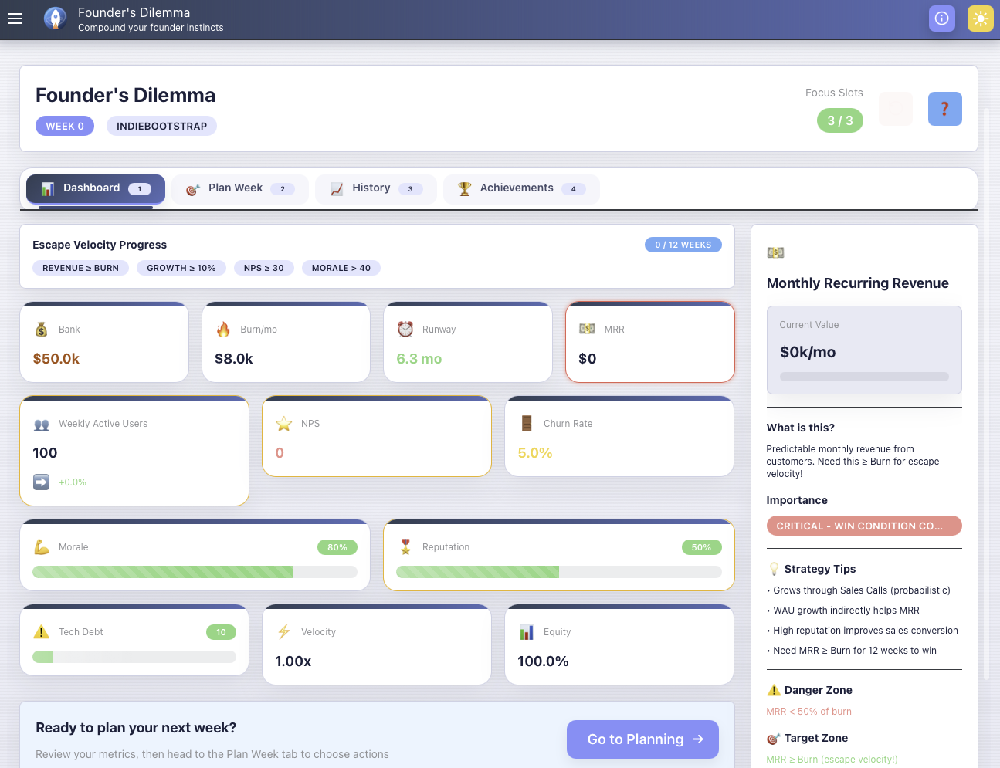

# Founder's Dilemma



**An educational startup simulation game that teaches real founder principles through gameplay.**

Navigate compounding constraints, make strategic decisions, and learn from your choices as you work toward sustainable product-market fit. The game rewards real-world best practices while teaching you the hard lessons of startup building through interactive dilemmas and educational feedback.

## 🎮 Game Overview

Play as a startup founder managing:
- **Financial**: Bank, burn rate, MRR, runway
- **Growth**: Users, growth rate, churn, NPS
- **Health**: Morale, reputation, momentum
- **Technical**: Tech debt, velocity, compliance

Choose from **15 strategic actions** each week, combining them for **synergy bonuses**. Navigate **dynamic market conditions** that affect your decisions, and **unlock advanced actions** as you progress through your founder journey.

### 🎓 Educational Game Systems

**The game teaches real founder principles through:**

1. **📊 Weekly Insights** - Educational feedback after each turn explaining why things happened and what to do
2. **✨ Compounding Effects** - Bonuses for sustained good practices (engineering excellence, customer love, strong culture, etc.)
3. **🚨 Failure Warnings** - Early warnings about dangerous patterns before they become crises
4. **⚖️ Strategic Dilemmas** - Tough choices with real trade-offs teaching startup decision-making

Every decision provides teaching moments based on real founder experiences.

### Win Condition: Escape Velocity

Sustain **all 4 conditions** for **12 consecutive weeks**:
1. Revenue ≥ Burn (profitability)
2. WAU Growth ≥ 10% (sustained growth)
3. NPS ≥ 30 (customer love)
4. Morale > 40 (founder health)

### Defeat Conditions

- **Out of Money**: Bank ≤ $0
- **Founder Burnout**: Morale ≤ 0
- **Reputation Destroyed**: Reputation ≤ 10

## 🚀 Getting Started

### Prerequisites

- Node.js 18+ (via nvm: `nvm use`)
- pnpm (`npm install -g pnpm`)
- Rust (for Tauri)

### Installation

```bash
# Install dependencies
pnpm install

# Start development server
pnpm dev
```

The game will open in a Tauri window. Navigate to "Founder's Dilemma" in the sidebar.

### Building for Production

```bash
pnpm tauri build
```

## 🎯 Difficulty Modes

**Indie Bootstrap**
- Starting Bank: $50k
- Monthly Burn: $8k
- Runway: 6.25 months
- Challenge: Low resources, slower growth

**VC Track**
- Starting Bank: $1M
- Monthly Burn: $80k
- Runway: 12.5 months
- Challenge: High burn, aggressive growth targets

**Regulated Fintech**
- Starting Bank: $500k
- Monthly Burn: $40k
- Runway: 12.5 months
- Challenge: High compliance burden

**Infrastructure/DevTool**
- Starting Bank: $300k
- Monthly Burn: $25k
- Runway: 12 months
- Challenge: Long sales cycles

## 📋 Available Actions

### Product (1 focus each)
- **Ship Feature (Quick)**: +WAU, +tech debt, +momentum *(Core)*
- **Ship Feature (Balanced)**: Moderate gains, balanced *(Core)*
- **Ship Feature (Polish)**: +reputation, -tech debt, slower *(Core)*
- **Refactor Code (Surface)**: -10-15 tech debt, +0.05 velocity *(Unlocks Week 5)*
- **Refactor Code (Deep)**: -25-35 tech debt, +0.15 velocity, -10% WAU *(Unlocks Week 5)*
- **Run Experiment**: Probabilistic insights, +5-15% metric boost *(Unlocks Week 9)*

### Sales & Growth (1-2 focus)
- **Founder-Led Sales (3 calls)**: Probabilistic MRR gain *(Core)*
- **Founder-Led Sales (5 calls)**: Higher MRR potential, more morale cost *(Core)*
- **Content Launch (Blog)**: +3-8% WAU, +5 reputation *(Unlocks Week 5)*
- **Content Launch (Tutorial)**: +5-12% WAU, +8 reputation, +5 NPS *(Unlocks Week 5)*
- **DevRel**: +15-25% WAU, +15 reputation, +10 morale, -$5k *(Unlocks Week 13)*
- **Paid Ads**: +10-30% WAU, -$10k-30k, effectiveness varies *(Unlocks Week 13)*

### Team (1-2 focus)
- **Hire**: +$10k burn, +velocity, +morale *(Core)*
- **Coach**: +10 morale, +0.1 velocity, +5 reputation *(Unlocks Week 5)*
- **Fire**: -$10k burn, -15 morale, -0.1 velocity *(Unlocks Week 21)*

### Capital (2 focus)
- **Fundraise ($250k)**: Attempt to raise capital *(Core)*
- **Fundraise ($500k)**: Larger raise, harder to close *(Core)*

### Operations (1-2 focus)
- **Compliance Work**: -15-25 compliance risk, -5 morale *(Unlocks Week 9)*
- **Incident Response**: Reduces reputation damage, high morale cost *(Unlocks Week 21)*
- **Process Improvement**: +velocity, reduces future incidents *(Unlocks Week 13)*

### Recovery (1 focus)
- **Take a Break**: +morale, -growth momentum *(Core)*

**Action Synergy Examples:**
- **Launch Momentum**: Ship Feature + Content Launch → +15% WAU boost
- **Engineering Excellence**: Refactor Code + Coach → +0.2 velocity
- **Integrated Marketing**: Paid Ads + Content Launch → 50% more effective

## 🎯 Strategic Systems

### Action Synergies
Combine complementary actions in the same turn for bonus effects:
- **Launch Momentum**: Ship Feature + Content Launch → +15% WAU boost
- **Engineering Excellence**: Refactor + Coach → +0.2 velocity
- **Integrated Marketing**: Paid Ads + Content → 50% more effective

### Market Conditions
External forces that modify gameplay:
- **Bull Market**: Easier fundraising, higher growth, expensive hiring
- **Recession**: Harder fundraising, lower growth, cheaper talent
- **Tech Boom**: Expensive hiring, high velocity, strong fundraising

### Specialization Paths
Focus your strategy to earn powerful bonuses:
- **Product Excellence**: 60%+ product actions → +0.3 velocity
- **Growth Hacking**: 60%+ growth actions → +5% WAU growth
- **Operational Efficiency**: 60%+ ops actions → -20% burn
- **Customer Obsessed**: 60%+ customer actions → +15 NPS

### Progression
Unlock advanced actions as you progress:
- Week 0-4: Core 5 actions (tutorial phase)
- Week 5-8: Unlock Refactor, Content, Coach
- Week 9-12: Unlock Experiments, Compliance
- Week 13+: Unlock DevRel, Paid Ads, Advanced actions

## 🎨 Tech Stack

**Backend (Rust)**
- Game engine with pure state machine
- Tauri for desktop integration
- Serde for serialization
- Chrono for timestamps

**Frontend (React + TypeScript)**
- Mantine UI components
- React Router for navigation
- Tauri API for Rust communication

## 📁 Project Structure

```
ai_working/founders-dilemma/
├── src-tauri/              # Rust backend
│   └── src/
│       ├── game/           # Game engine
│       │   ├── state.rs            # GameState, DifficultyMode
│       │   ├── actions.rs          # Action resolution
│       │   ├── events.rs           # Event system
│       │   ├── events_enhanced.rs  # Strategic dilemmas
│       │   ├── insights.rs         # Weekly educational insights
│       │   ├── compounding.rs      # Compounding effects system
│       │   ├── warnings.rs         # Failure warning system
│       │   ├── economy.rs          # Revenue/burn model
│       │   └── victory.rs          # Win/loss detection
│       └── lib.rs          # Tauri commands
├── src/                    # React frontend
│   ├── types/
│   │   └── game-systems.ts # TypeScript interfaces for new systems
│   ├── views/
│   │   └── GameView.tsx    # Main game view
│   └── components/
│       └── game/           # Game components
│           ├── GameDashboard.tsx       # Main dashboard with tabs
│           ├── StatsPanel.tsx          # Metrics display
│           ├── ActionSelector.tsx      # Action selection
│           ├── WeeklyInsights.tsx      # Educational feedback UI
│           ├── FailureWarnings.tsx     # Warning display UI
│           ├── CompoundingBonuses.tsx  # Bonus notifications UI
│           ├── EventModal.tsx          # Strategic dilemma UI
│           ├── HistoryView.tsx         # Historical charts
│           └── GameOver.tsx            # End game screen
├── GAME_DESIGN.md         # Complete design spec
├── IMPLEMENTATION_PLAN.md # 3-week roadmap
└── PROGRESS.md            # Implementation progress
```

## 🧪 Testing

```bash
# Run Rust tests
cd src-tauri
cargo test

# Run frontend (when added)
pnpm test
```

## 🎓 Game Design Philosophy

**Ruthless Simplicity**
- Clear mechanics with transparent effects
- No hidden complexity
- Every action has trade-offs

**Compounding Consequences**
- Early decisions affect late game
- Tech debt slows velocity
- Low morale reduces productivity
- High churn erodes MRR

**Multiple Viable Strategies**
- Bootstrap slowly
- Raise capital and burn fast
- Balance growth and stability
- No single "correct" path

## 📊 Implementation Status

**Core Systems:**
- ✅ Rust game engine with state management
- ✅ React UI with Mantine components
- ✅ Tab-based navigation (Dashboard, Plan Week, History, Achievements)
- ✅ Multiple difficulty modes
- ✅ All 15 actions with strategic depth
- ✅ Escape velocity win condition

**Educational Systems:**
- ✅ Weekly Insights - Educational feedback after each turn
- ✅ Compounding Effects - Rewards for sustained good practices
- ✅ Failure Warnings - Early warning system for dangerous patterns
- ✅ Strategic Dilemmas - Event system with meaningful choices

**Strategic Systems:**
- ✅ Action Synergies - Bonus effects for complementary actions
- ✅ Market Conditions - Dynamic external modifiers
- ✅ Specialization Paths - Strategic focus bonuses
- ✅ Progression System - Unlockable actions and milestones

**UI/UX:**
- ✅ Enhanced theme with professional polish
- ✅ Historical charts and week-by-week timeline
- ✅ Metrics sidebar with contextual information
- ✅ Critical status banners
- ✅ Keyboard shortcuts

**Current State**: Fully playable with enhanced strategic depth!

## 🤝 Contributing

This is a learning project. Feel free to:
- Play and provide feedback
- Suggest balance changes
- Report bugs
- Propose new actions or events

## 📝 License

MIT

## 🎯 Future Enhancements

**Potential Additions:**
- [ ] Advanced metrics and analytics dashboard
- [ ] Tutorial/onboarding flow
- [ ] Sound effects and music
- [ ] Save game persistence
- [ ] Achievements system expansion
- [ ] Multiplayer/leaderboard
- [ ] More difficulty modes
- [ ] Custom scenarios
- [ ] Seasonal challenges and meta-progression
- [ ] Community synergy/event creation tools

**Community Ideas:**
- Submit new action synergy combinations
- Propose market conditions based on real startup experiences
- Suggest strategic dilemmas from your founder journey
- Create custom difficulty modes with unique constraints

---

**Ready to play?** Run `pnpm dev` and start your founder journey! 🚀
